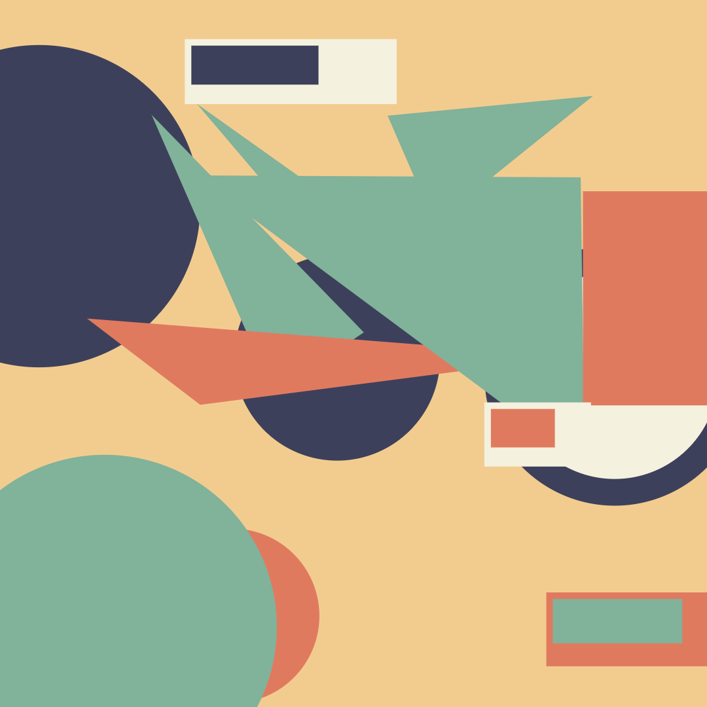
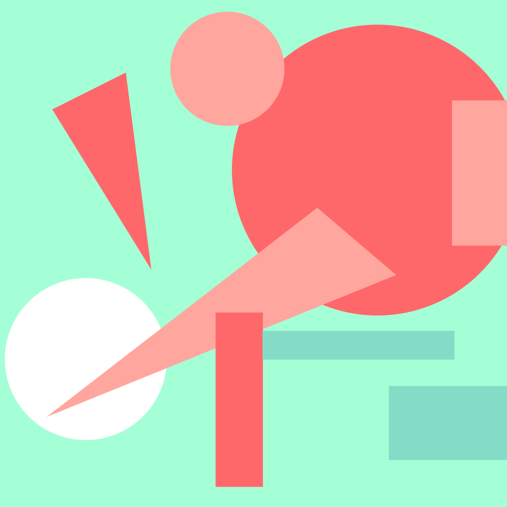
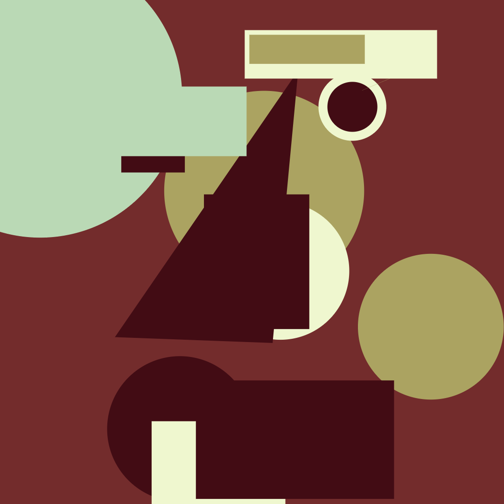
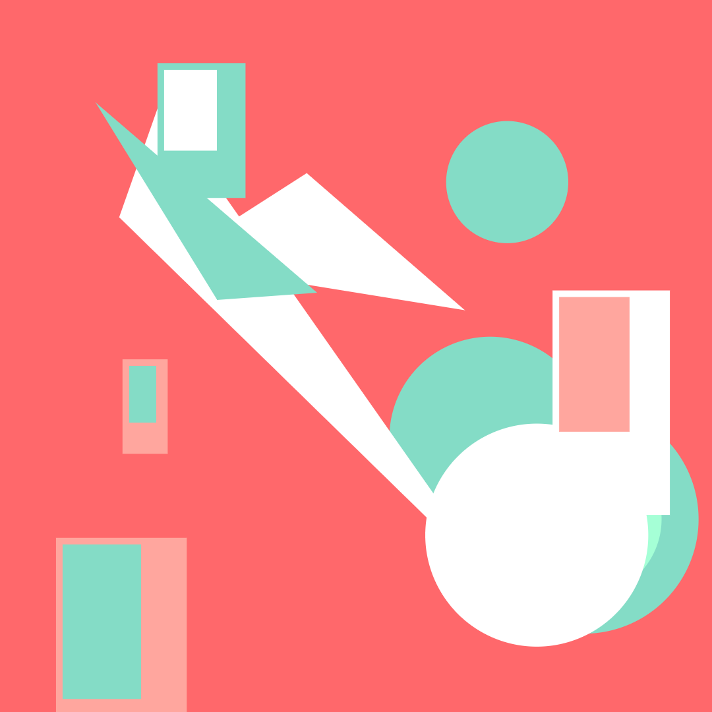
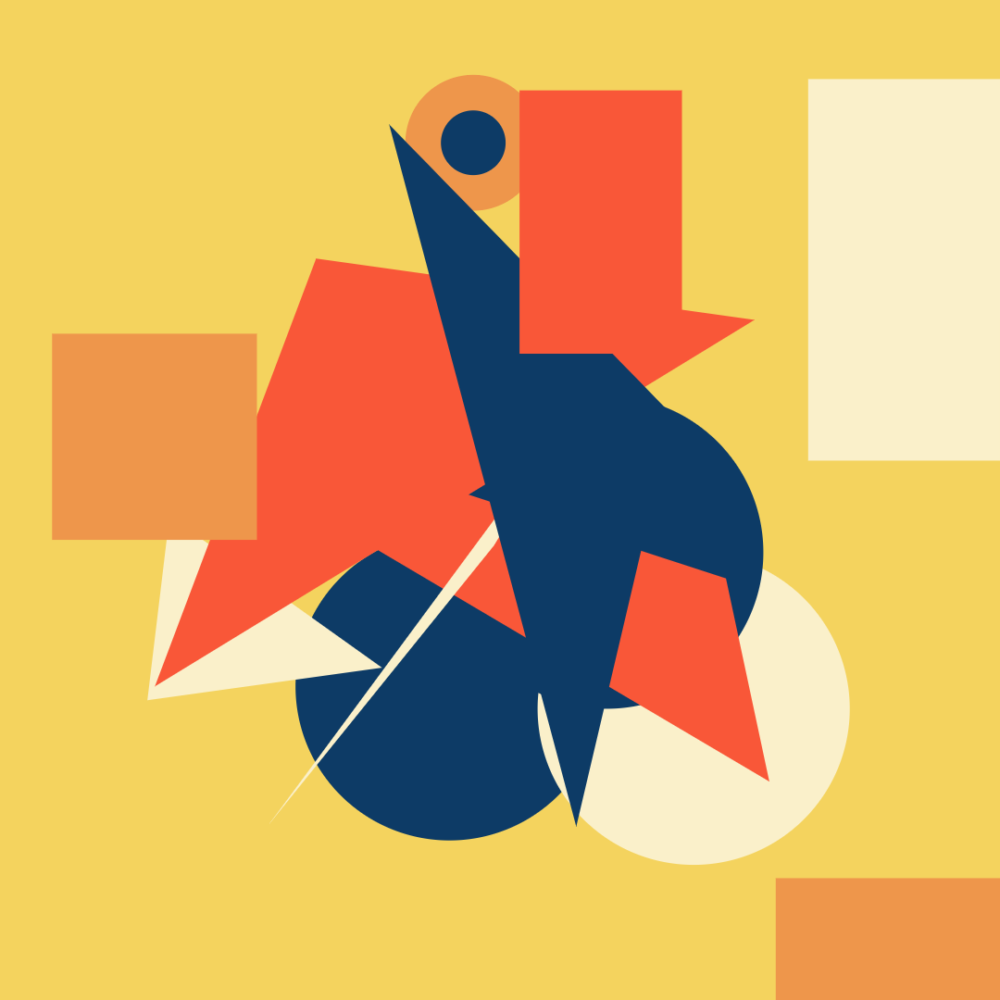
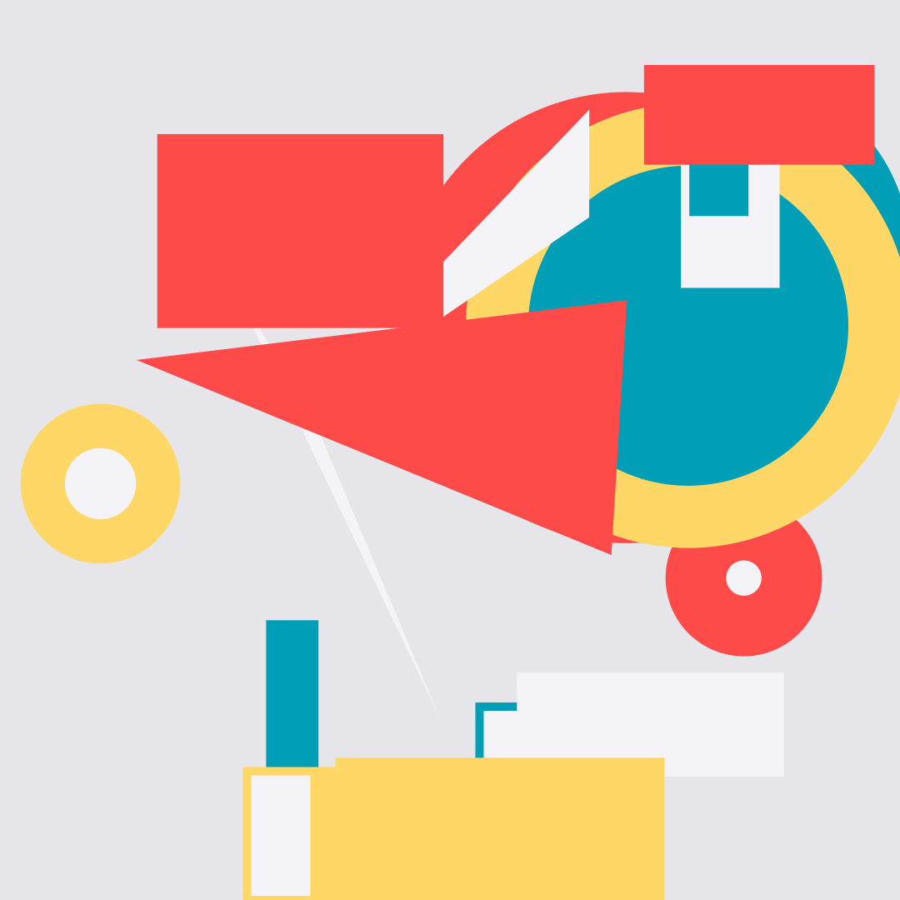

# code-art-color-study
Geometry designs using canvas-sketch library.

----------------------------------------------------------------

## Pre-requisites

- [canvas-sketch](https://github.com/mattdesl/canvas-sketch).
----------------------------------------------------------------

## Commands 

Start project 
```
canvas-sketch index.js
```
Expoting images 
```
canvas-sketch index.js --output=output/
```
----------------------------------------------------------------
## Art created

Images can be fined in the ouputs folder.







